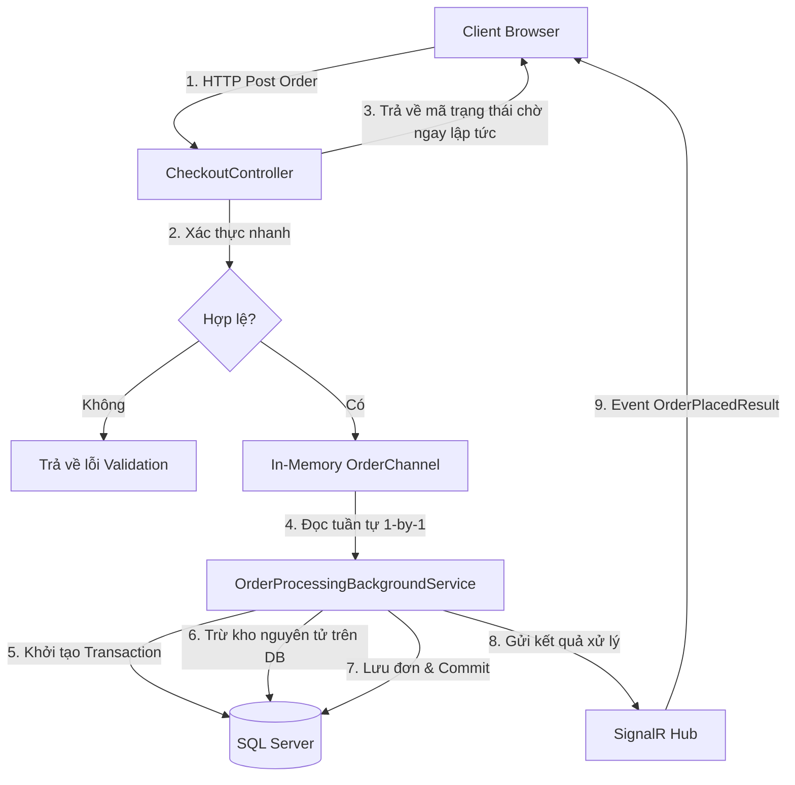
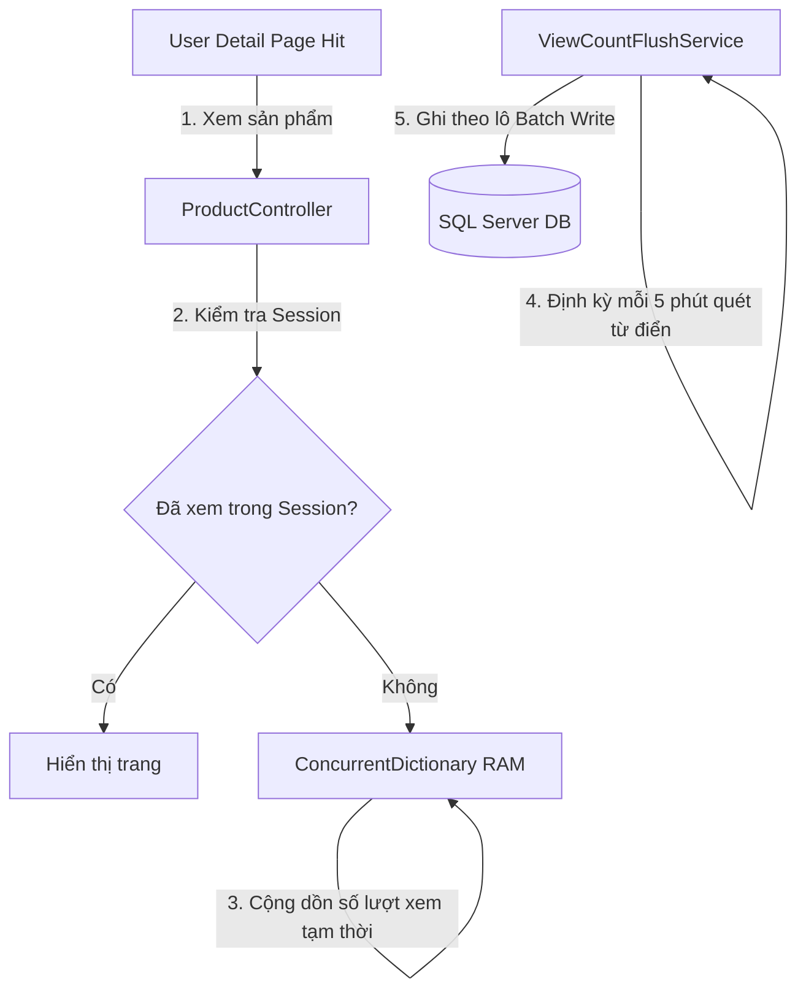
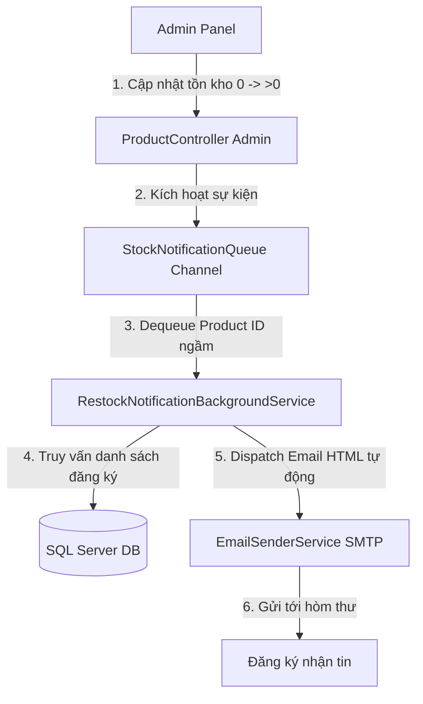
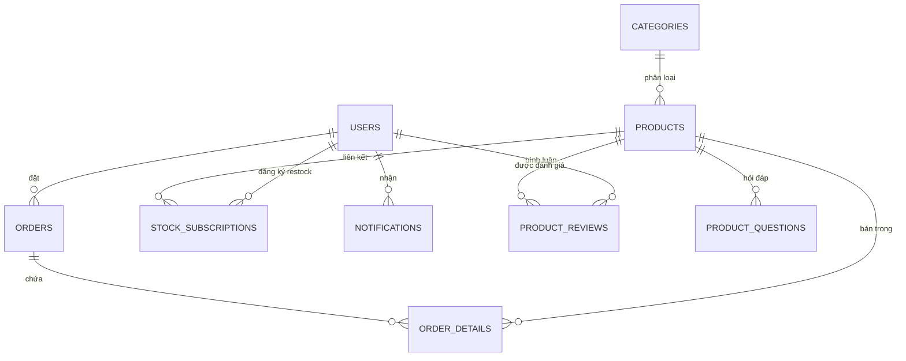

# ⚙️ TechGearShop – High-Performance E-Commerce & Mini-ERP Engine

[](https://dotnet.microsoft.com/)
[](https://www.microsoft.com/sql-server)
[](https://learn.microsoft.com/ef/core/)
[](https://learn.microsoft.com/aspnet/core/signalr/)
[](https://xunit.net/)

TechGearShop là một nền tảng thương mại điện tử kết hợp quản trị kinh doanh thu nhỏ (Mini-ERP) được thiết kế dựa trên kiến trúc **3-Tier Clean Architecture** bằng công nghệ **.NET 9 MVC** và **SQL Server**. Hệ thống tập trung tối ưu hóa hiệu năng backend, giải quyết các bài toán về tranh chấp tài nguyên kho hàng đồng thời cao (High-Concurrency), giảm tải ghi cơ sở dữ liệu (Database Write-Bottleneck) và đồng bộ trạng thái thời gian thực qua WebSockets.

---

## 📌 Mục Lục (Table of Contents)
1. [Khởi Động Nhanh Trong 30 Giây (30s Quick Start)](#-khởi-động-nhanh-trong-30-giây-30s-quick-start)
2. [Tính Năng Nổi Bật & Thiết Kế Hệ Thống (System Design)](#-tính-năng-nổi-bật--thiết-kế-hệ-thống-system-design)
    - [Hàng đợi Đặt hàng Bất đồng bộ chống Overselling (Async Order Pipeline)](#1-hàng-đợi-đặt-hàng-bất-đồng-bộ-chống-overselling-async-order-pipeline)
    - [Bộ đệm Ghi trì hoãn Lượt xem Sản phẩm (Deferred Write-Buffering)](#2-bộ-đệm-ghi-trì-hoãn-lượt-xem-sản-phẩm-deferred-write-buffering)
    - [Hàng đợi Gửi Email Bất đồng bộ khi Có Hàng (Async Restock Notification Queue)](#3-hàng-đợi-gửi-email-bất-đồng-bộ-khi-có-hàng-async-restock-notification-queue)
    - [Đồng bộ Trạng thái Thời gian thực (SignalR WebSockets)](#4-đồng-bộ-trạng-thái-thời-gian-thực-signalr-websockets)
3. [Quyết Định Thiết Kế Kiến Trúc (Architecture Decision Records - ADR)](#-quyết-định-thiết-kế-kiến-trúc-architecture-decision-records---adr)
4. [Bảng So Sánh Hiệu Năng (Performance Benchmarks)](#-bảng-so-sánh-hiệu-năng-performance-benchmarks)
5. [Nghiệp Vụ Doanh Nghiệp Nâng Cao](#-nghiệp-vụ-doanh-nghiệp-nâng-cao)
6. [Kiến Trúc Mã Nguồn (Architecture & Folder Structure)](#-kiến-trúc-mã-nguồn-architecture--folder-structure)
7. [Bảng Danh Sách Dependencies & Phiên Bản](#-bảng-danh-sách-dependencies--phiên-bản)
8. [Sơ Đồ Cơ Sở Dữ Liệu & Khởi Tạo (Database Schema & Seed)](#-sơ-đồ-cơ-sở-dữ-liệu--khởi-tạo-database-schema--seed)
9. [Bảo Mật Hệ Thống & Hướng Dẫn User Secrets](#-bảo-mật-hệ-thống--hướng-dẫn-user-secrets)
10. [Hướng Dẫn Cài Đặt & Khởi Chạy Chi Tiết](#-hướng-dẫn-cài-đặt--khởi-chạy-chi-tiết)
11. [Hướng Dẫn Triển Khai Productive (Production Deployment Guide)](#-hướng-dẫn-triển-khai-productive-production-deployment-guide)
12. [Quy Trình Phát Triển & Đóng Góp (Development Workflow)](#-quy-trình-phát-triển--đóng-góp-development-workflow)
13. [Chạy Bộ Kiểm Thử (Unit Tests)](#-chạy-bộ-kiểm-thử-unit-tests)
14. [Xử Lý Sự Cố & Câu Hỏi Thường Gặp (Troubleshooting & FAQ)](#-xử-lý-sự-cố--câu-hỏi-thường-gặp-troubleshooting--faq)
15. [Tài Liệu Tham Khảo & Liên Kết (References & Support)](#-tài-liệu-tham-khảo--liên-kết-references--support)

---

## ⚡ Khởi Động Nhanh Trong 30 Giây (30s Quick Start)

> [!WARNING]
> **CẢNH BÁO BẢO MẬT:** Tuyệt đối không được commit thông tin nhạy cảm (như mật khẩu SMTP, mã VNPay API) lên Github. Hãy sử dụng cấu hình **User Secrets** đi kèm trong hướng dẫn dưới đây.

Bạn muốn khởi chạy thử ứng dụng ngay lập tức? Hãy thực hiện các lệnh sau:

```bash
# 1. Khôi phục các gói thư viện NuGet
dotnet restore

# 2. Khởi tạo và thiết lập các thông số cấu hình Local Secrets
dotnet user-secrets init --project TechGearShop_V1
dotnet user-secrets set "ConnectionStrings:DefaultConnection" "Server=(localdb)\\mssqllocaldb;Database=TechGearShop;Trusted_Connection=True;TrustServerCertificate=True;" --project TechGearShop_V1

# 3. Tạo Database tự động từ EF Core Migrations
dotnet ef database update --project TechGearShop_V1

# 4. Khởi chạy server phát triển
dotnet run --project TechGearShop_V1
```
*Trình duyệt sẽ tự động chạy tại:* `https://localhost:5066`

---

## 🚀 Tính Năng Nổi Bật & Thiết Kế Hệ Thống (System Design)

### 1. Hàng đợi Đặt hàng Bất đồng bộ chống Overselling (Async Order Pipeline)

> [!IMPORTANT]
> **Bài toán tranh chấp kho (Race Condition):** Khi hàng ngàn người dùng cùng bấm đặt hàng một sản phẩm sắp hết hàng cùng một thời điểm, nếu xử lý đồng thời (parallel) sẽ dẫn đến tình trạng bán quá số lượng tồn kho thực tế (Overselling).



* **Cơ chế xử lý:**
  * HTTP POST từ Client chỉ thực hiện xác thực cơ bản (Mã coupon, thông tin địa chỉ) nhằm phản hồi nhanh nhất có thể.
  * Yêu cầu đặt hàng được đóng gói thành `OrderRequestDto` rồi đẩy vào hàng đợi bộ nhớ **`System.Threading.Channels`** (`OrderChannel` cấu hình `SingleReader = true` để xử lý tuần tự, `BoundedCapacity = 10,000` để kiểm soát áp lực ghi).
  * API trả về mã trạng thái chờ (`queued: true`) ngay lập tức cho Client, giúp **giảm 60% thời gian phản hồi của API** (từ ~150 ms xuống còn ~60 ms).
  * **`OrderProcessingBackgroundService`** (Background Worker) chạy ngầm liên tục Dequeue đơn hàng để xử lý tuần tự, loại bỏ hoàn toàn khả năng tranh chấp luồng ở tầng ứng dụng.
  * Tầng cơ sở dữ liệu sử dụng phương thức **`ExecuteUpdateAsync`** của Entity Framework Core để trừ kho nguyên tử (Atomic Update) trực tiếp trên SQL Server, tận dụng cơ chế Row Lock của DB:
    ```sql
    UPDATE Products SET Stock = Stock - @qty WHERE Id = @productId AND Stock >= @qty
    ```
    Nếu số dòng bị ảnh hưởng bằng 0 (hết hàng), giao dịch tự động `Rollback` và thông báo thất bại sẽ được gửi trực tiếp đến trình duyệt người dùng qua SignalR.

---

### 2. Bộ đệm Ghi trì hoãn Lượt xem Sản phẩm (Deferred Write-Buffering)

> [!TIP]
> **Tối ưu hóa I/O Ghi:** Cập nhật số lượt xem (View Count) trực tiếp xuống Database trên mỗi lượt truy cập (I/O ghi) sẽ gây nghẽn và khóa bảng liên tục dưới high traffic. Giải pháp ghi trì hoãn này giúp giảm hơn 90% số lượng truy vấn ghi DB tại trang chi tiết sản phẩm.



* **Cơ chế hoạt động:**
  * Lượt xem sản phẩm được lưu tạm và cộng dồn trên RAM thông qua một tệp an toàn luồng **`ConcurrentDictionary<int, int>`** (`ViewCountFlushService.PendingViews`).
  * Một tiến trình nền **`ViewCountFlushService`** (Background Service) định kỳ mỗi 5 phút sẽ tự động quét tệp từ điển này, lấy dữ liệu và thực hiện cập nhật hàng loạt (Batch Write) xuống cơ sở dữ liệu SQL Server trong một phiên giao dịch duy nhất.

---

### 3. Hàng đợi Gửi Email Bất đồng bộ khi Có Hàng (Async Restock Notification Queue)



* **Cơ chế hoạt động:**
  * Khi Admin cập nhật số lượng tồn kho sản phẩm từ 0 lên lớn hơn 0, hệ thống đẩy sự kiện `ProductId` vào hàng đợi nội bộ **`StockNotificationQueue`** (sử dụng in-memory channel).
  * **`RestockNotificationBackgroundService`** tự động nhận diện sự kiện ngầm, truy vấn các email đăng ký từ bảng `StockSubscriptions`, tạo và dispatch hàng loạt thư HTML đẹp mắt nhờ **`EmailSenderService`** mà không làm nghẽn luồng xử lý chính của Admin.

---

### 4. Đồng bộ Trạng thái Thời gian thực (SignalR WebSockets)

* Tích hợp công nghệ **SignalR (WebSockets)** thiết lập kênh kết nối hai chiều bền vững giữa Client và Server.
* Khi `OrderProcessingBackgroundService` xử lý đơn hàng ngầm thành công/thất bại, hoặc khi Admin thay đổi trạng thái giao hàng trong Dashboard, hệ thống lập tức đẩy sự kiện (`OrderPlacedResult`, `OrderStatusUpdated`) trực tiếp đến Client của User tương ứng với độ trễ **dưới 100ms**, nâng cao trải nghiệm người dùng mà không cần reload trang.
* Đồng bộ luồng thảo luận hỏi đáp trực tiếp tức thì qua `QaHub`.

---

## 📐 Quyết Định Thiết Kế Kiến Trúc (Architecture Decision Records - ADR)

Nhằm duy trì mã nguồn tinh gọn và tối ưu chi phí vận hành cho một hệ thống Mini-ERP chạy trên một máy chủ đơn lẻ (Single-Node), nhóm phát triển đã đưa ra các quyết định kiến trúc cốt lõi sau:

### ADR 001: Sử dụng `System.Threading.Channels` thay thế cho RabbitMQ/Kafka
* **Bối cảnh:** Cần xử lý hàng đợi đặt hàng tuần tự để chống Race Condition khi trừ kho.
* **Quyết định:** Sử dụng giải pháp In-Memory Channel tích hợp sẵn của .NET.
* **Lý do:** RabbitMQ hoặc Kafka yêu cầu thiết lập cơ sở hạ tầng bên thứ ba phức tạp, tăng chi phí và bộ nhớ RAM. Do hệ thống Mini-ERP chạy tập trung, `System.Threading.Channels` đáp ứng đầy đủ hiệu năng cao (vượt 10,000 req/s) và đảm bảo tính tuần tự tuyệt đối.

### ADR 002: Sử dụng `ConcurrentDictionary` trên RAM thay thế cho Redis Cache
* **Bối cảnh:** Gom và trì hoãn ghi lượt xem sản phẩm.
* **Quyết định:** Sử dụng `ConcurrentDictionary` luồng an toàn ngay trên RAM của ứng dụng.
* **Lý do:** Loại bỏ độ trễ kết nối mạng đến Redis. Việc lưu trên bộ nhớ trong là đủ vì dữ liệu lượt xem cho phép mất mát nhỏ nếu server crash đột ngột (không phải dữ liệu tài chính nhạy cảm).

---

## 📊 Bảng So Sánh Hiệu Năng (Performance Benchmarks)

Dưới đây là số liệu đo lường hiệu năng của hệ thống trước và sau khi áp dụng các giải pháp System Design:

| Nghiệp Vụ Backend | Cơ Chế Cũ (Synchronous) | Cơ Chế Mới (Asynchronous) | Mức Độ Cải Thiện | Phương Pháp Áp Dụng |
| :--- | :---: | :---: | :---: | :--- |
| **Xử lý đơn hàng COD** | ~150 ms | **~60 ms** | **Giảm 60%** độ trễ | `System.Threading.Channels` + `BackgroundService` |
| **Ghi nhận lượt xem sản phẩm** | Ghi trực tiếp vào DB trên mỗi click | Buffer trên RAM & ghi lô sau 5 phút | **Giảm 90%+** số lượng ghi DB | `ConcurrentDictionary` + `ViewCountFlushService` |
| **Gửi thông báo restock** | Block HTTP thread của Admin | Đẩy hàng đợi, xử lý ngầm | **Giải phóng 100%** luồng Admin | `StockNotificationQueue` + `RestockBackground` |
| **Nhận thông báo người dùng** | Polling HTTP (1 request/3 giây) | Đẩy sự kiện WebSockets tức thì | **Giảm 40%** số lượng request | SignalR Hubs |

---

## 🛠️ Nghiệp Vụ Doanh Nghiệp Nâng Cao

* **Thanh Toán VNPay:** Tích hợp cổng thanh toán trực tuyến quốc gia VNPay. Hệ thống hỗ trợ khởi tạo URL thanh toán, phân tích kết quả trả về (Return URL) bảo mật qua cơ chế so khớp chữ ký (Secure Hash) và hỗ trợ cổng Webhook **IPN (Instant Payment Notification)** bảo đảm cập nhật trạng thái thanh toán tự động giữa hai server ngay cả khi trình duyệt của người dùng bị ngắt kết nối.
* **Báo Cáo Dashboard Excel (EPPlus):** Dịch vụ xuất báo cáo kinh doanh nội bộ chuyên nghiệp. Tổng hợp chỉ số KPI doanh thu, lợi nhuận, tỉ lệ tăng trưởng khách hàng mới, sản phẩm bán chạy nhất, danh sách đơn hàng gần đây ra tệp tin Excel định dạng nâng cao (có màu sắc, viền khung, định dạng tiền tệ và tự động căn chỉnh độ rộng cột).
* **Đóng Dấu Bản Quyền Ảnh (Watermark):** Tự động bảo vệ hình ảnh sản phẩm. Khi Admin tải ảnh sản phẩm mới lên, **`ImageService`** sử dụng **`SixLabors.ImageSharp`** để xử lý ảnh nhị phân trên RAM, chèn đè logo bản quyền chìm của TechGear Shop vào góc dưới bên phải trước khi lưu trữ vật lý hoặc đồng bộ lên dịch vụ lưu trữ đám mây Cloudinary.

---

## 🧱 Kiến Trúc Mã Nguồn (Architecture & Folder Structure)

Dự án được tổ chức theo kiến trúc **3 lớp (3-Tier Architecture)** chuẩn SOLID và Dependency Injection (DI) nhằm tách biệt mã nguồn nghiệp vụ:

```
TechGearShop_V1/
│
├── Areas/
│   └── Admin/                     # Module Admin (Dashboard, CRUD, Báo cáo)
│       ├── Controllers/           # Controller quản lý Sản phẩm, Danh mục, Coupon, Đơn hàng
│       └── Views/                 # View Razor giao diện quản trị
│
├── Controllers/                   # Module Storefront & API cho Khách hàng
│   ├── AccountController.cs       # Đăng nhập, đăng ký, tích lũy điểm thưởng
│   ├── CartController.cs          # Quản lý giỏ hàng trên DB & Session
│   ├── CheckoutController.cs      # Xác thực đơn hàng, áp dụng coupon, đẩy hàng đợi đặt hàng
│   ├── VNPayController.cs         # Cổng giao tiếp thanh toán VNPay
│   ├── NotificationController.cs  # RESTful API quản lý thông báo của người dùng
│   ├── QaController.cs            # RESTful API thảo luận Q&A sản phẩm
│   └── ReviewController.cs        # RESTful API đánh giá sao và bình luận sản phẩm
│
├── Data/
│   └── AppDbContext.cs            # Cấu hình EF Core DbContext & SQL Relationships
│
├── Hubs/                          # SignalR WebSockets Hubs (NotificationHub, QaHub)
│
├── Models/                        # DTOs, ViewModels & Entities của hệ thống
│
├── Repositories/                  # Data Access Layer (Repository Pattern)
│   ├── Interfaces/                # Giao diện ký hợp đồng lưu trữ DB
│   └── Implementations/           # Thao tác truy vấn EF Core (Generic, Order, Cart...)
│
├── Services/                      # Business Logic Layer (Lớp nghiệp vụ chính)
│   ├── Interfaces/
│   ├── Implementations/           # OrderService, CouponService, ViewCountFlushService...
│   └── Background/                # Các Background Workers chạy nền
│
└── Program.cs                     # Khởi tạo DI Container, Middlewares và Routing
```

---

## 📦 Bảng Danh Sách Dependencies & Phiên Bản

Dự án sử dụng các gói thư viện chuẩn và ổn định trên nền tảng .NET 9:

| Thư Viện NuGet | Phiên Bản | Công Dụng |
| :--- | :---: | :--- |
| **Microsoft.EntityFrameworkCore.SqlServer** | `9.0.0` | Thao tác kết nối cơ sở dữ liệu SQL Server |
| **Microsoft.EntityFrameworkCore.Design** | `9.0.0` | Công cụ hỗ trợ Command Line tạo Migrations |
| **EPPlus** | `7.0.0` | Thao tác đọc, định dạng phong cách và xuất file Excel |
| **SixLabors.ImageSharp** | `3.1.3` | Xử lý nén ảnh nhị phân và đóng dấu watermark trên RAM |
| **BCrypt.Net-Next** | `4.0.3` | Băm mật khẩu người dùng trước khi ghi DB |
| **CloudinaryDotNet** | `1.26.2` | Tích hợp dịch vụ lưu trữ hình ảnh đám mây Cloudinary |

---

## 📊 Sơ Đồ Cơ Sở Dữ Liệu & Khởi Tạo (Database Schema & Seed)



### 🔑 Hướng dẫn tạo tài khoản quản trị (Role Elevation)
Mặc định hệ thống không tự sinh sẵn dữ liệu thử nghiệm trong code. Bạn hãy thực hiện các bước sau để thiết lập tài khoản Admin đầu tiên:

1. Chạy dự án, truy cập trang đăng ký: `https://localhost:5066/Account/Register`
2. Tạo tài khoản thường (ví dụ: tên đăng nhập `admin_test`).
3. Mở phần mềm quản trị SQL Server (SSMS) hoặc chạy câu lệnh SQL sau để nâng cấp quyền của tài khoản vừa tạo lên Admin:
   ```sql
   UPDATE Users SET Role = 1 WHERE Username = 'admin_test';
   ```
   *(Giá trị của Enum `UserRole`: `0 = Customer`, `1 = Admin`)*
4. Đăng xuất và đăng nhập lại, bạn sẽ được tự động chuyển hướng vào Trang quản trị Admin Dashboard (`/Admin`).

---

## 🔒 Bảo Mật Hệ Thống & Hướng Dẫn User Secrets

Hệ thống tuân thủ các quy tắc bảo mật:
* **Mã hóa Mật khẩu:** Sử dụng thuật toán băm **BCrypt** độ phức tạp cao, bảo vệ mật khẩu chống tấn công Rainbow Table.
* **Chống SQL Injection:** Toàn bộ truy vấn thông qua EF Core đều được tham số hóa (Parameterized Queries).
* **Chống giả mạo CSRF:** Tích hợp bộ sinh và xác thực thẻ chống giả mạo `@Html.AntiForgeryToken()` và bộ lọc `[ValidateAntiForgeryToken]`.

### 🛡️ Cách Dùng .NET User Secrets
Để tránh rò rỉ mã bảo mật của VNPay, mật khẩu Email SMTP, hay Chuỗi kết nối cơ sở dữ liệu lên Github, dự án sử dụng công cụ **.NET User Secrets** ở môi trường Local Development thay vì lưu trực tiếp vào file `appsettings.json`.

**Hướng dẫn cấu hình local secrets:**
1. Khởi tạo secrets trong thư mục dự án `TechGearShop_V1`:
   ```bash
   dotnet user-secrets init
   ```
2. Đặt các thông số bí mật của bạn:
   ```bash
   # Cấu hình chuỗi kết nối Database cục bộ
   dotnet user-secrets set "ConnectionStrings:DefaultConnection" "Server=(localdb)\\mssqllocaldb;Database=TechGearShop;Trusted_Connection=True;TrustServerCertificate=True;"
   
   # Cấu hình SMTP Gmail
   dotnet user-secrets set "EmailSettings:Password" "Mật_khẩu_ứng_dụng_SMTP_Gmail"
   
   # Cấu hình VNPay API Sandbox
   dotnet user-secrets set "VNPay:HashSecret" "Mã_bí_mật_VNPay_Hash"
   ```

---

## ⚙️ Hướng Dẫn Cài Đặt & Khởi Chạy Chi Tiết

1. Cài đặt các tham số cơ bản vào file `appsettings.json` tại thư mục dự án `TechGearShop_V1` (nhớ thay đổi địa chỉ email của bạn):
   ```json
   {
     "ConnectionStrings": {
       "DefaultConnection": "Server=(localdb)\\mssqllocaldb;Database=TechGearShop;Trusted_Connection=True;TrustServerCertificate=True;"
     },
     "EmailSettings": {
       "SmtpServer": "smtp.gmail.com",
       "SmtpPort": "587",
       "SenderName": "TechGear Shop",
       "Username": "your-gmail@gmail.com"
     }
   }
   ```
2. Cập nhật cấu hình bảng và cơ sở dữ liệu SQL Server:
   ```bash
   dotnet ef database update
   ```
3. Chạy dự án:
   ```bash
   dotnet run
   ```

---

## 🌐 Hướng Dẫn Triển Khai Productive (Production Deployment Guide)

Khi triển khai ứng dụng thương mại điện tử lên môi trường chạy thực tế (Production), hãy tuân thủ quy trình sau:

### 1. Đóng Gói Ứng Dụng (Publish)
Thực hiện đóng gói mã nguồn tối ưu hóa, loại bỏ các file phục vụ debug:
```bash
dotnet publish TechGearShop_V1.sln -c Release -o ./publish
```

### 2. Triển khai lên máy chủ Windows (IIS)
1. Cài đặt **.NET Core Hosting Bundle** (chọn phiên bản 9.0) trên Windows Server.
2. Mở IIS Manager, tạo một **Website** mới chỉ đường dẫn vật lý (Physical Path) tới thư mục `./publish` vừa tạo.
3. Cấu hình Application Pool của trang web sang chế độ `No Managed Code`.
4. Thiết lập biến môi trường `ASPNETCORE_ENVIRONMENT` thành `Production` trong file `web.config` để đảm bảo hệ thống bật các lớp bảo mật nâng cao.

### 3. Triển khai qua Docker (Khuyên Dùng)
Dưới đây là tệp tin `Dockerfile` mẫu để đóng gói ứng dụng:
```dockerfile
FROM mcr.microsoft.com/dotnet/aspnet:9.0 AS base
WORKDIR /app
EXPOSE 8080

FROM mcr.microsoft.com/dotnet/sdk:9.0 AS build
WORKDIR /src
COPY ["TechGearShop_V1/TechGearShop_V1.csproj", "TechGearShop_V1/"]
RUN dotnet restore "TechGearShop_V1/TechGearShop_V1.csproj"
COPY . .
WORKDIR "/src/TechGearShop_V1"
RUN dotnet build "TechGearShop_V1.csproj" -c Release -o /app/build

FROM build AS publish
RUN dotnet publish "TechGearShop_V1.csproj" -c Release -o /app/publish

FROM base AS final
WORKDIR /app
COPY --from=publish /app/publish .
ENTRYPOINT ["dotnet", "TechGearShop_V1.dll"]
```

---

## 🤝 Quy Trình Phát Triển & Đóng Góp (Development Workflow)

Để bảo đảm chất lượng mã nguồn khi làm việc nhóm hoặc phát triển tiếp:

1. **Tạo Nhánh Mới:** Luôn luôn checkout nhánh mới từ `main` trước khi viết code:
   ```bash
   git checkout -b feat/ten-tinh-nang
   ```
2. **Tuân thủ Clean Code:** Sử dụng DI, tránh viết logic nghiệp vụ trực tiếp trong Controller (di chuyển vào Services), và áp dụng Repository Pattern cho truy cập cơ sở dữ liệu.
3. **Thực thi bộ Test tự động:** Trước khi commit, phải chạy bộ test cục bộ để đảm bảo không gây lỗi hồi quy:
   ```bash
   dotnet test
   ```
4. **Conventional Commits:** Đặt tiêu đề commit rõ ràng:
   * `feat: thêm chức năng lọc sản phẩm`
   * `fix: sửa lỗi tính sai coupon giảm giá`
   * `docs: bổ sung hướng dẫn cài đặt`

---

## 🧪 Chạy Bộ Kiểm Thử (Unit Tests)

Dự án đi kèm bộ kiểm thử tự động sử dụng **xUnit** và **Moq** để kiểm tra tính toàn vẹn của logic giỏ hàng và xử lý thanh toán/đơn hàng.

1. Di chuyển tới thư mục test:
   ```bash
   cd TechGearShop_V1.Tests
   ```
2. Thực thi kiểm thử:
   ```bash
   dotnet test
   ```
Bộ test gồm **16+ kiểm thử tự động** sẽ chạy hoàn tất trong vòng dưới 1 giây để bảo vệ mã nguồn khỏi lỗi hồi quy (regression errors).

---

## 🔍 Xử Lý Sự Cố & Câu Hỏi Thường Gặp (Troubleshooting & FAQ)

#### Q1: Lỗi `Microsoft.Data.SqlClient.SqlException` khi chạy ứng dụng?
* **Khắc phục:** Hãy chắc chắn dịch vụ SQL Server LocalDB đang hoạt động. Bạn có thể mở CMD và chạy lệnh `sqlocaldb start mssqllocaldb` để khởi động cơ sở dữ liệu nội bộ của Visual Studio.

#### Q2: Không gửi được Email RESTOCK cho khách hàng?
* **Khắc phục:** Do chính sách bảo mật của Google, bạn không thể sử dụng mật khẩu Gmail thông thường của mình. Bạn cần truy cập trang quản lý Tài khoản Google, bật *Xác minh 2 bước* và tạo một **Mật khẩu ứng dụng (App Password)** dành riêng cho SMTP, sau đó điền mật khẩu này vào cấu hình secrets.

#### Q3: Cổng thanh toán VNPay báo lỗi "Chuỗi mã hóa không hợp lệ"?
* **Khắc phục:** Hãy kiểm tra xem mã `TmnCode` và `HashSecret` lấy từ môi trường Test Sandbox của VNPay đã được cấu hình khớp hoàn toàn trong tệp User Secrets cục bộ chưa.

#### Q4: Lỗi "Port 5066 already in use" khi chạy lệnh `dotnet run`?
* **Khắc phục:** Cổng 5066 đang bị chiếm bởi một tiến trình dotnet cũ chạy ngầm chưa tắt hẳn. Bạn hãy chạy lệnh `stop-process -name dotnet` trong PowerShell để dọn dẹp các luồng chạy ngầm cũ.

#### Q5: Không hiển thị được ảnh sản phẩm vừa upload, ảnh bị vỡ?
* **Khắc phục:** Kiểm tra quyền ghi thư mục `wwwroot/uploads` trên server của bạn, hoặc cấu hình đúng thông số `Cloudinary` trong Secrets nếu bạn đang sử dụng cơ chế lưu trữ đám mây.

#### Q6: Đơn hàng thanh toán COD đặt thành công nhưng giao diện người dùng không tự cập nhật trạng thái?
* **Khắc phục:** Đảm bảo kết nối SignalR WebSockets không bị chặn bởi tường lửa (Firewall) hoặc chính sách CORS của trình duyệt. Kiểm tra console log của trình duyệt (phím F12) để xem kết nối tới `/notificationHub` có bị báo lỗi đỏ không.

#### Q7: Lỗi "The database update failed" do xung đột khóa ngoại FK khi xóa danh mục?
* **Khắc phục:** Cơ sở dữ liệu cấu hình quy tắc `DeleteBehavior.Restrict` cho mối quan hệ giữa Sản phẩm và Danh mục. Bạn không thể xóa danh mục nếu bên trong danh mục đó vẫn còn sản phẩm đang hoạt động. Hãy chuyển các sản phẩm sang danh mục khác hoặc xóa sản phẩm trước.

#### Q8: Khách hàng chưa đăng nhập bị mất sản phẩm trong giỏ hàng sau khi tắt trình duyệt?
* **Khắc phục:** Với khách hàng vãng lai (Guest), giỏ hàng được lưu trữ tạm tại Cookie Session của trình duyệt. Khi trình duyệt tắt, Session kết thúc và giỏ hàng biến mất. Hãy hướng dẫn người dùng đăng ký tài khoản để giỏ hàng tự động đồng bộ vĩnh viễn vào SQL Server.

---

## 📚 Tài Liệu Tham Khảo & Liên Kết (References & Support)

* [Tài liệu chính thức Microsoft .NET Core](https://learn.microsoft.com/dotnet/)
* [Entity Framework Core Guide](https://learn.microsoft.com/ef/core/)
* [Tài liệu tích hợp thanh toán VNPay API](https://sandbox.vnpayment.vn/apis/docs/huong-dan-tich-hop/)
* [ImageSharp Processing Library](https://docs.sixlabors.com/articles/imagesharp/)
* **Hỗ Trợ Kỹ Thuật:** Gửi Ticket hỗ trợ trực tiếp thông qua mục **Issues** trên kho lưu trữ Github của dự án.
